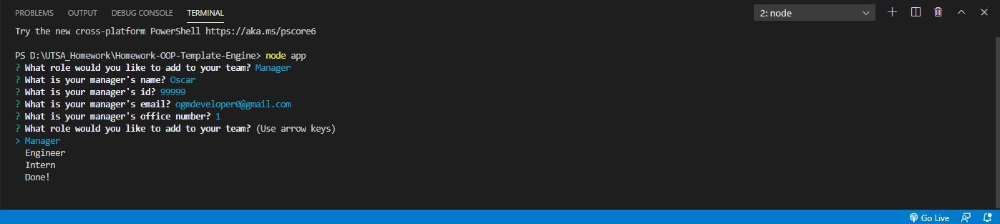
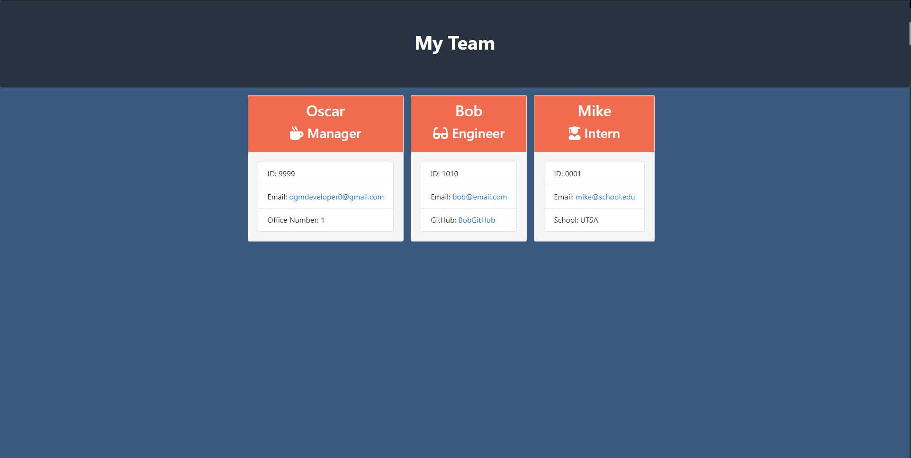

# Homework-OOP-Template-Engine


## Full Stack Boot Camp Homework 10 - Template Engine

### Description
This is the tenth assignment for the UTSA Full-Stack Bootcamp. It is a Node.js command-line application that takes in information about employees and dynamically generates an HTML webpage that displays summaries for each individual.

### Table of Contents

* [Installation](#installation)
* [Screenshots](#screenshots)
* [License](#license)
* [Technologies Used](#technologies%20used)
* [Questions](#questions)

### Installation
To install necessary dependencies, run the following command:
```
npm i
```
The program can then be run using the following command line in the bash terminal or integrated terminal:
```
node app.js
```
### Screenshots 
[Here](http://bit.ly/3n9fxw0) is a video walkthrough of the project.





### License
This project is licensed under the MIT License. 

### Technologies Used:
Back End:
* [Node.js](https://nodejs.org/en/)
* [Inquirer Package](https://www.npmjs.com/package/inquirer)

### Questions
If you have any questions about the repo, open an issue or contact me directly at ogmdeveloper0@gmail.com. You can find more of my work through my [GitHub Account](https://github.com/ogmedina/).